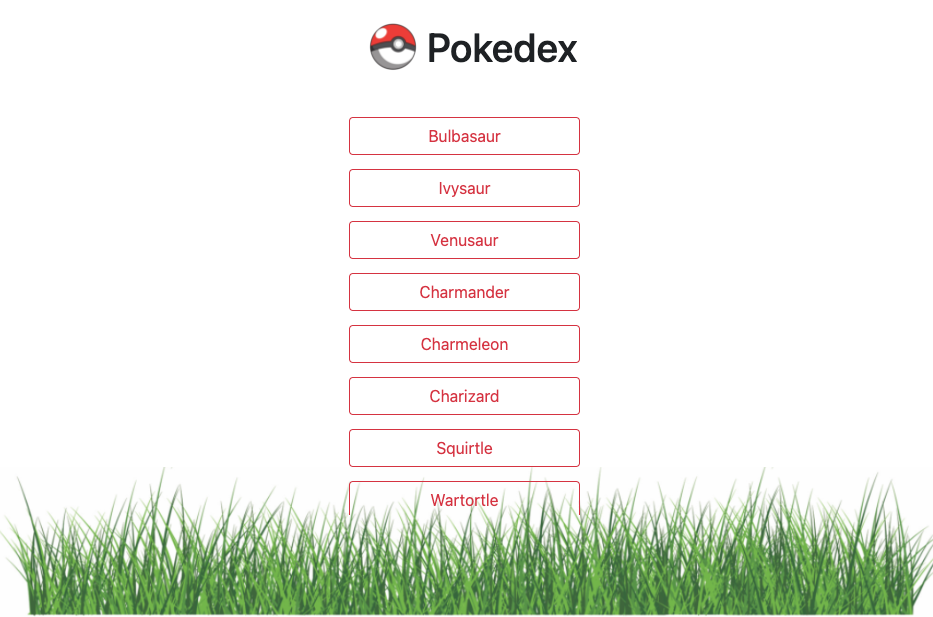

# simple-js-app

Simple app that displays interactive list of
pokemon. 

App utilizes [PokeApi](https://pokeapi.co/) for pokemon content,
Bootstrap for app layout and formatting, and CSS for additional styling. 

 
  

# Features
Users can click on the pokemon name to view a modal that contains
details and an image of each pokemon.

# Technologies
* JavaScript
* jQuery
* HTML
* CSS
* Bootstrap